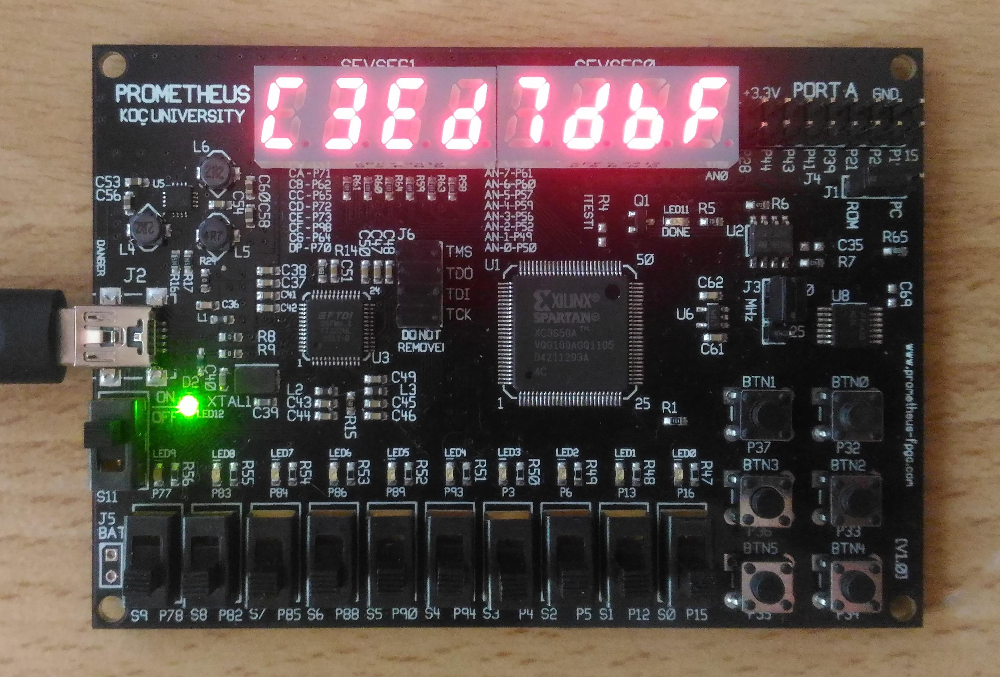

# Device DNA reader for Prometheus FGPA (Spartan 3A)

Chips of the Spartan 3A and Spartan 6 families of FPGAs have unique device DNA identifiers. This code uses DNA_PORT primitive to read the content of the DNA register.
Inputs and outputs are customized for the Prometheus FPGA board.
Use: Pess button "BTN1" to load DNA of the device into a register, least significant 32 bits will be shown on eight 7-segment displays. Toggle switch "S0" to display most significant bits (bits 57 to 33).

Copyleft (C) 2017

DNA_Reader_Prometheus is free software: you can redistribute it and/or modify it under the terms of the GNU General Public License as published by the Free Software Foundation, either version 2 of the License, or (at your option) any later version.

DNA_Reader_Prometheus is distributed in the hope that it will be useful, but WITHOUT ANY WARRANTY; without even the implied warranty of MERCHANTABILITY or FITNESS FOR A PARTICULAR PURPOSE. See the GNU General Public License v2.0 for more details.
